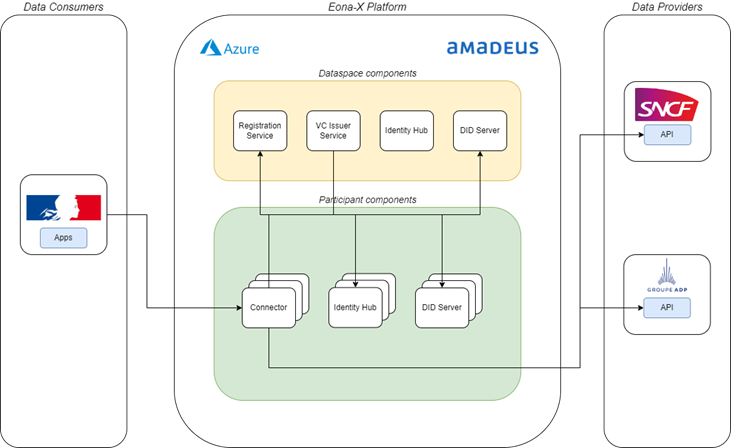

# EONA-X

## Introdution

This repository contains a modified version of the documentation and resources helping Eona-X participants to deploy and manage their Eona-X dataspace components.

The EONA-X MVD is based on the Eclipse MVD. EONA-X aims to provide a dataspace for logistic, mobility, and tourism stakeholders. It is based oncreate concrete use cases.

### From Platforms to Data Spaces 

EONA-X key concepts are [https://eona-x.eu/]:

- A decentralized architecture: Participants of EONA-X dataspaces keep control on their data which is distributed in several facilites. Metadata on the these data is shared in a federated catalog. Access to these data is done under agreed policies.

- Transparent governance framework: Ensures secure, compliant, and fair data sharing, building trust across sectors.

- Logistic, Mobility and Tourism: The shared data is tailored to specific needs, like optimizing traffic, improving user experiences, or predicting demand.


## ENOA-X Framework: A Decentralized Data Space

The design principles of the EONA-X framework are the following[https://eona-x.eu/]:

- Trust: EONA-X relies on European standards to guarantee the traceability, compliance and autonomy of each actor. Data circulates within a controlled framework, between trusted partners.

- Decentralization: The data stays where it is produced. Thanks to federated orchestration, exchanges are secure, without concentration of data or dependence on a single platform.

- Open source: Provide an open and interoperable technological architecture, accessible to all, without proprietary locks. Transparency is at the heart of our approach.




## Deployment of the Data Space Participants components

### Prerequisite

- [OpenTofu](https://opentofu.org/): A reliable, flexible, community-driven infrastructure as code tool alternative to Terraform 
- cURL or Postman
- Hashicorp Vault CLI

### Create a Kubernetes cluster

A Kubernetes cluster is needed with an an Ingress Controller.

### Deploy the Vault and DB (optional)

```bash
cd deployment/opentofu/storage
tofu init
tofu apply -auto-approve
```

### Deploy the connector

```bash
cd deployement/opentofu/connector
```

#### Specify the Eona-X/EDC version

```bash
EONAX_VERSION=0.4.0
```

#### Login to the Docker registry

Use the token provided by Amadeus in order to log to the Docker registry.

```bash
GITHUB_TOKEN="<YOUR_TOKEN_HERE>"
echo $GITHUB_TOKEN | docker login ghcr.io -u amadeusitgroup --password-stdin
```

#### Pull Helm chart and Docker images

```bash
CLUSTER=eonax-cluster
DOCKER_IMAGE_REPO=ghcr.io/amadeusitgroup/dataspace_ecosystem
HELM_CHART_REPO=oci://ghcr.io/amadeusitgroup/dataspace_ecosystem/helm

for i in control-plane data-plane identity-hub; do \
  image=eonax-$i-postgresql-hashicorpvault; \
  
  ## pull the Docker image
  docker pull $DOCKER_IMAGE_REPO/$image:$EONAX_VERSION; \
  ## tag image with version latest
  docker tag $DOCKER_IMAGE_REPO/$image:$EONAX_VERSION $image:latest; \
  ## load image to the cluster
  kind load docker-image $image:latest --name $CLUSTER; \
  
  ## pull Helm chart
  chart=${i//-/}; \
  helm pull $HELM_CHART_REPO/$chart --version $EONAX_VERSION; \
  mv $chart-$EONAX_VERSION.tgz $chart.tgz; \
done
```

## Routes to be exposed over the internet

4 routes must imperatively be exposed over the internet, as they are used for communication with the other connectors:

- the **Control Plane DSP url** (port 8282 of the control plane)
- the **Data Plane public url** (port 8181 of the data plane)
- the **Identity Hub presentation url** (port 8282 of the identity hub)
- the **DID document url ** (port 8383 of the identity hub)

We strongly recommend to expose these routes through a web application firewall and implements rate limiting.

Set the public facing urls in environment variables as shown below (please take of updating the values based on your
deployment topology as the ones provided below are only relevant for a local deployment).

```bash
DID_WEB=did:web:localhost:ih:did
DID_WEB_BASE64_URL=$(echo -n "$DID_WEB" | base64 | tr '+/' '-_' | tr -d '=')
IH_PRESENTATION_URL=http://localhost/ih/presentation
CP_DSP_URL=http://localhost/cp/dsp
DP_PUBLIC_URL=http://localhost/dp/public
EONAX_DID_WEB=did:web:test.api.eona-x.dataspace-platform.amadeus.com:ih:did:authority
```

Then create the `terraform.tfvars` file:

```bash
cat <<EOF > terraform.tfvars
identity_hub_did_web_url = "$DID_WEB"
control_plane_dsp_url = "$CP_DSP_URL"
data_plane_public_url = "$DP_PUBLIC_URL"
EOF
```

### Deploy the connector

If you are using your own Vault and/or DB, please take care of updating the vault url and token secret name, and the DB
url, username and password in the `variables.tf` file.

```bash
tofu init
tofu apply -auto-approve
```

### Initialize connector

To initialize the connector please type the following:

```bash
kubectl -n eonax apply -f init-connector-job.yaml
```

#### Generate key pair

```bash
openssl genpkey -algorithm RSA -out private-key.pem -pkeyopt rsa_keygen_bits:2048 && \
openssl rsa -pubout -in private-key.pem -out public-key.pem && \
for k in public-key private-key; do VAULT_TOKEN=root VAULT_ADDR=http://localhost/vault vault kv put secret/$k content=@$k.pem; done
```

#### Create participant context

```bash
curl -X POST -H "Content-Type: application/json" -d "$(cat <<EOF
{
  "participantId": "$DID_WEB",
  "did": "$DID_WEB",
  "active": true,
  "key": {
    "keyId": "my-key",
    "privateKeyAlias": "private-key",
    "publicKeyPem": "$(awk 'NF {sub(/\r/, ""); printf "%s\\n",$0;}' public-key.pem)"
  },
  "serviceEndpoints": [
    {
      "id": "credential-service-url",
      "type": "CredentialService",
      "serviceEndpoint": "$IH_PRESENTATION_URL/v1/participants/$DID_WEB_BASE64_URL"
    },
    {
      "id": "dsp-url",
      "type": "DSPMessaging",
      "serviceEndpoint": "$CP_DSP_URL"
    }
  ]
}
EOF
)" http://localhost/ih/identity/v1alpha/participants
```

#### To request an Eona-X Membership Verifiable Credential (VC):

To initiate the request for your membership Verifiable Credential (VC), please contact Eona-X with your Decentralized Identifier (DID) and participant name. Eona-X will forward both your DID and participant name to the VC issuer, who will then issue the credential.

Once you receive confirmation from Eona-X that the VC has been successfully issued, you can proceed to retrieve it by calling the API provided below.

```bash
curl -X POST -H "Content-Type: application/json" -d "$(cat <<EOF
{
    "issuerDid": "$EONAX_DID_WEB",
    "holderPid": "$DID_WEB",
    "credentials": [
        {
            "format": "VC1_0_JWT",
            "credentialType": "MembershipCredential"
        }
    ]
}
EOF
)" http://localhost/ih/identity/v1alpha/participants/$DID_WEB_BASE64_URL/credentials/request
```

## Usage of the connector

On top of the public urls mentioned above which are used for interactions with the other connectors, there are 3 urls
that are only for internal usage and should preferably be kept in the company's private network:

- the Control Plane management url (port 8181 of the control plane), those are typically the ones used to define the
  business configuration of the connector.
- the Identity Hub identity url (port 8181 of the identity hub) which is used to write/read credentials from the
  identity hub.
- the Data Plane data url (port 8282 of the Data Plane) which is used to query data the data from a provider.

## Common Vulnerabilities Exposure (CVE)

List of opened CVE records can be
found [here](https://cve.mitre.org/cgi-bin/cvekey.cgi?keyword=eclipse+dataspace+connector).

Each record has a score calculated with
this [calculator](https://www.first.org/cvss/calculator/4.0#CVSS:4.0/AV:N/AC:L/AT:P/PR:H/UI:N/VC:N/VI:N/VA:N/SC:H/SI:H/SA:N/RE:L/U:Green).


## Known Issues

